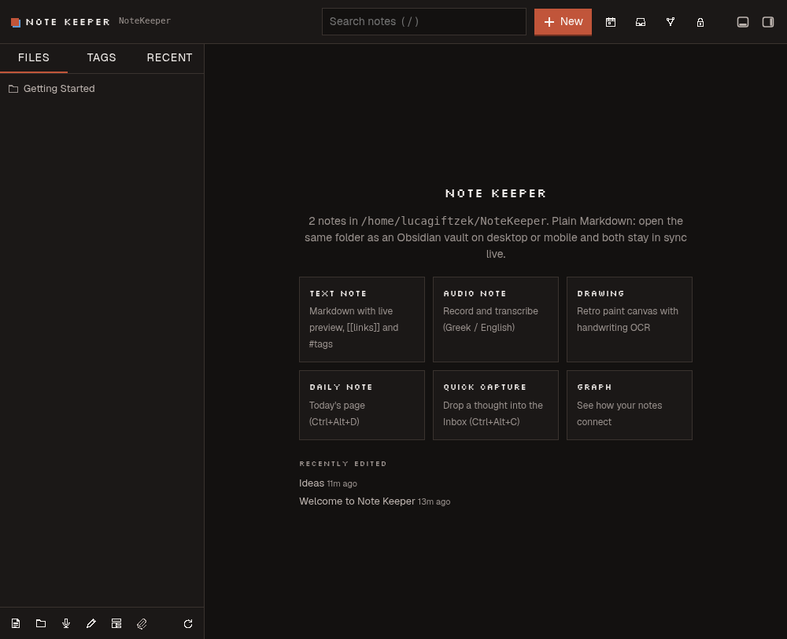
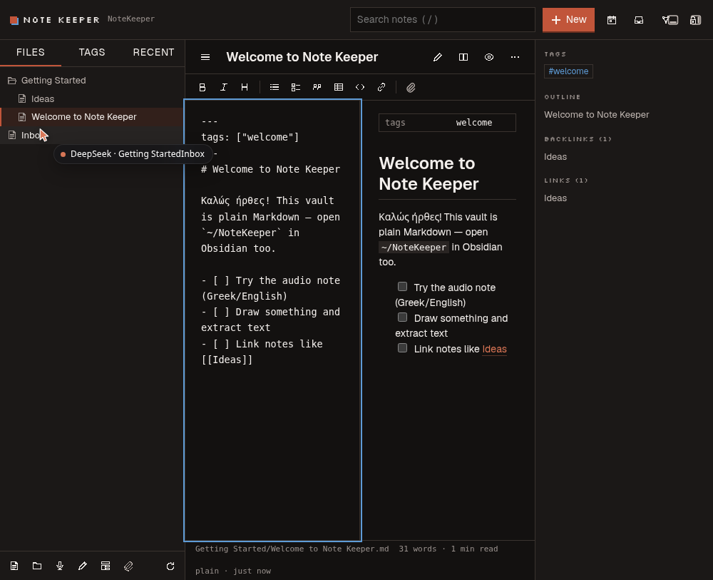
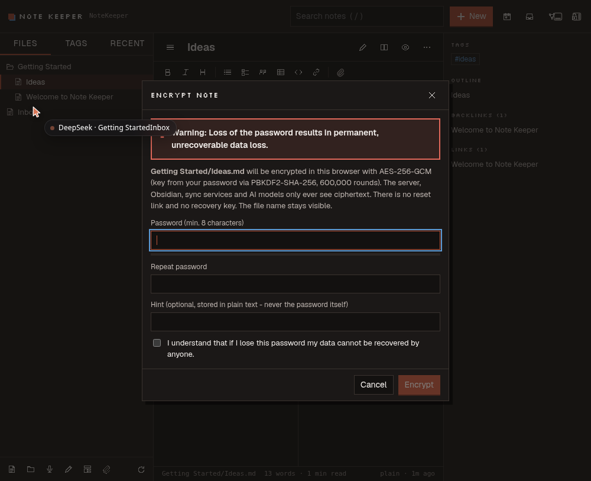
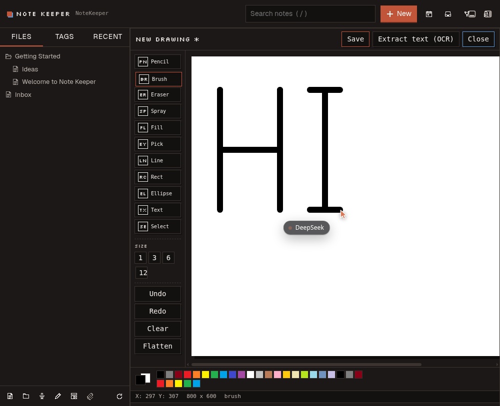
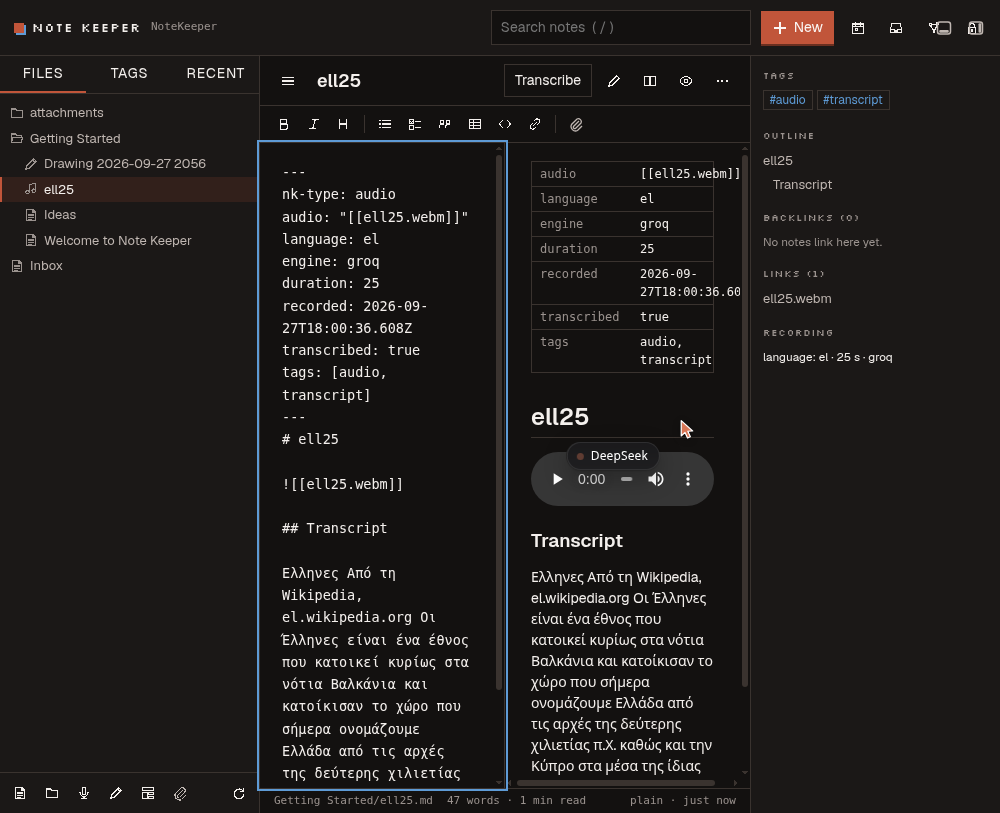
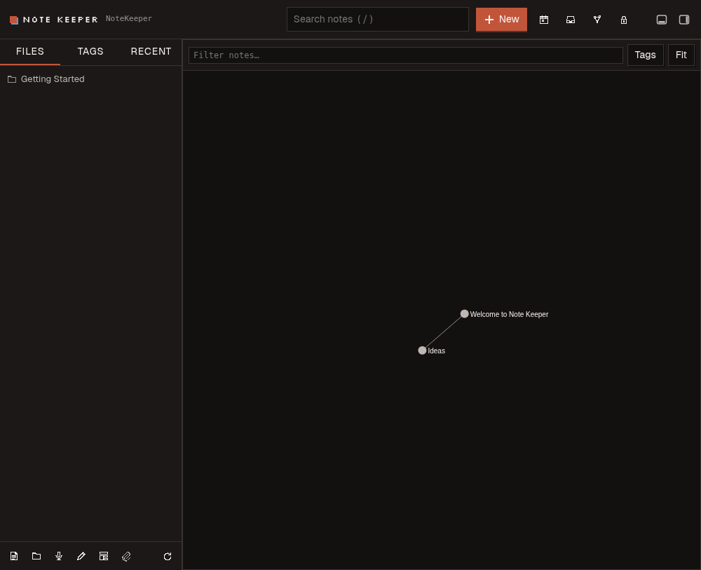

# Note Keeper (`dsh-note-keeper`)

Note Keeper is a plugin for the DeepSeek Harness (DSH) web GUI: an
Obsidian-compatible, local-first notes app that lives in the left sidebar and
opens as a full-page panel. It stores notes as plain Markdown files in a
regular directory on disk, so any Obsidian-compatible sync method keeps it in
step with a phone or another desktop. It also exposes a set of `notes_*`
tools so an AI in the same DSH chat can read, search and write the user's
notes under a clear set of guardrails.

Author: Loukas "Luca" Tzekos. License: MIT.

## Feature overview

- **Left-sidebar "Notes" entry** — a row in the sidebar panel list
  (`sidebar.panellist` slot) that opens Note Keeper as a full-page panel
  registered in the main-column keyed slot.
- **Obsidian-compatible vault** — plain Markdown files under a normal
  directory (default `~/NoteKeeper`, configurable via `vault`). Wikilinks
  (`[[Note]]`), embeds (`![[Note]]`), `#tags` (including nested
  `project/alpha`), YAML frontmatter, callouts (`> [!warning]`), and a
  `.trash` folder for recoverable deletes, exactly the way Obsidian lays
  them out.
- **Rename-safe wikilinks** — moving or renaming a note rewrites every
  `[[wikilink]]`/`![[embed]]` that pointed at it, in every other note, the
  same way Obsidian does.
- **Live sync from any writer** — an fsnotify-backed watcher reindexes any
  change (this app's own writes, Obsidian on the same machine, a sync
  client landing a phone edit) and pushes a Server-Sent Events refresh to
  every open browser tab; a 5-minute full rescan repairs anything a dropped
  kernel event missed.
- **Full-text search** — accent-insensitive for both Greek and Latin script
  (Καλημέρα ≈ καλημερα ≈ ΚΑΛΗΜΕΡΑ), last-word prefix matching while typing,
  and `"quoted phrase"` matching. Filterable by tag (nested tags included)
  or folder.
- **Tags, backlinks, outline, graph** — a tag browser with counts, a
  backlinks panel per note, a heading outline, and an interactive local
  graph view (note/attachment/tag nodes, plus "ghost" nodes for unresolved
  links, just like Obsidian's graph).
- **Quick capture & daily notes** — one shortcut appends a timestamped
  bullet (or a `- [ ]` task) to `Inbox.md`; another opens or creates
  today's daily note at `Daily/YYYY-MM-DD.md`, expanding
  `Templates/Daily.md` when present.
- **Templates** — any note under the `Templates/` folder can be used to
  start a new note, with `{{title}}`, `{{date}}` and `{{time}}` expanded.
- **Audio notes** — record with `MediaRecorder`, send the clip to the
  `dsh-voice` plugin's `/api/voice/stt` endpoint with the language pinned
  (Greek and English are first-class; several others are offered; "auto"
  lets the engine detect), optionally run a text-polish pass, and save the
  result as a Markdown note with `nk-type: audio` frontmatter
  (`language`, `engine`, `duration`) embedding the audio clip.
- **Retro paint canvas** — an MS-Paint-style drawing editor: pencil, brush,
  eraser, spray and more, over a raster canvas plus an editable vector shape
  layer. Saving writes a PNG, the vector JSON, and (optionally) OCR'd text
  from the drawing into a single "drawing" note.
- **OCR** — Tesseract (`eng+ell` by default) runs over pasted/attached
  images and over paint-canvas drawings to extract text (handwriting
  included, on a best-effort basis).
- **Attachments** — upload, paste, or drag-and-drop images, audio, video and
  PDF, with inline previews; risky file types (HTML, SVG, JS, …) are always
  forced to download so an uploaded file can never script the DSH origin.
- **Client-side zero-knowledge encryption** — see the [Security model](#security-model)
  section below. Encrypted notes/attachments/folders are opaque to the
  server, to sync tools and to AI tools; only the browser that knows the
  password can read them.
- **Conflict detection** — every save carries the mtime it was read at; a
  concurrent edit from another device, Obsidian, or an AI tool produces a
  conflict banner offering "load disk version", "keep both" or "overwrite
  with mine", instead of silently clobbering data.
- **Autosave** — edits are saved 1.2 s after the last keystroke, and flushed
  immediately when the tab is hidden or closed.
- **12 AI tools** (`notes_*`) — see the [AI tools](#ai-tools) table.

## Screenshots

Captured from the live DSH GUI with the tzekos.eu theme (dark mode).

| | |
|---|---|
|  |  |
|  |  |
|  |  |

## Install

Note Keeper installs like any other DSH web plugin.

1. Build it (Go ≥ 1.22 and Node ≥ 22.5):

   ```bash
   git clone https://github.com/lucagiftzek/dsh-note-keeper.git
   cd dsh-note-keeper
   npm ci
   npm run build      # bin/notekeeperd (Go daemon) + lib/client.js (browser bundle)
   ```

   Optional: `sudo apt install tesseract-ocr tesseract-ocr-ell` for OCR.

2. Link it into the web profile, `~/.dsh/profiles/web/package.json`: add
   `"dsh-note-keeper": "link:/path/to/dsh-note-keeper"` to `dependencies` and
   `"dsh-note-keeper"` to `dsh.profile.bundles`, then run `pnpm install` there.

3. Optional configuration goes on the plugin row in
   `~/.dsh/profiles/web/cordis.patch.yml`:

   ```yaml
   - id: dsh-note-keeper
     config:
       vault: ~/NoteKeeper          # or point at an existing Obsidian vault
       trustedHosts: [llm.tzekos.eu]
       aiWrite: true
       aiDelete: true
   ```

4. Restart dsh-web. A **Notes** row appears in the left sidebar.

Kill switch: `DSH_NOTE_KEEPER_DISABLE=1` in the dsh-web environment, or
`- id: dsh-note-keeper` / `disabled: true` in `cordis.patch.yml`.

## Configuration

All keys are optional; defaults come from `DEFAULTS` in `lib/index.js`.

| Key | Default | Meaning |
| --- | --- | --- |
| `vault` | `~/NoteKeeper` | Vault directory (created if missing). Point at an existing Obsidian vault to share it. `~` is expanded; the `NK_VAULT` environment variable overrides this. |
| `trustedHosts` | `['llm.tzekos.eu']` | Extra hostnames (besides loopback) the browser gate accepts as same-origin. |
| `requireCookie` | `true` | Require the DSH browser-session cookie on every request (reads included). |
| `binary` | `bin/notekeeperd` inside the package | Path to the `notekeeperd` Go binary. |
| `tesseract` | `tesseract` | Tesseract binary/name used for OCR. |
| `dailyFolder` | `Daily` | Folder for daily notes (`Daily/YYYY-MM-DD.md`). |
| `inboxNote` | `Inbox.md` | Target note for quick capture. |
| `attachmentsFolder` | `attachments` | Default folder for uploads. |
| `templatesFolder` | `Templates` | Folder scanned for note templates. |
| `aiWrite` | `true` | Whether the `notes_*` tools may create/modify notes. |
| `aiDelete` | `true` | Whether the `notes_*` tools may delete (trash) notes/folders. |

## Keyboard shortcuts

Global (active while the Note Keeper page is mounted):

| Shortcut | Action |
| --- | --- |
| `Ctrl+Alt+N` | New note |
| `Ctrl+Alt+C` | Quick capture dialog |
| `Ctrl+Alt+D` | Open/create today's daily note |
| `Ctrl+E` | Toggle preview mode (while a note is open) |
| `/` (outside a text field) | Focus the search box |

In the editor textarea:

| Shortcut | Action |
| --- | --- |
| `Ctrl+B` / `Cmd+B` | Bold |
| `Ctrl+I` / `Cmd+I` | Italic |
| `Ctrl+S` / `Cmd+S` | Save now |
| `Tab` / `Shift+Tab` | Indent / outdent the current line |
| `Enter` | Continue a list, numbered list or task item; an empty item ends the list |
| `[[` | Triggers wikilink autocompletion (arrow keys to navigate, `Enter`/`Tab` to accept, `Escape` to dismiss) |

## Obsidian sync guide

Note Keeper's vault is a plain directory of Markdown files laid out the way
Obsidian expects — there is no proprietary database or format. This is
deliberate: it is what lets the vault be edited from more than one place at
once.

- **Same machine:** open the vault folder (default `~/NoteKeeper`) directly
  as an Obsidian vault. Every change either app makes appears live in the
  other (Note Keeper watches the folder with fsnotify and refreshes over
  SSE within a fraction of a second; Obsidian watches it natively).
- **Other desktops and mobile:** use whatever the estate already relies on
  to sync a plain folder — **Syncthing** (Android and desktop), **Obsidian
  Sync**, **iCloud** or **Möbius Sync** on iOS, or **git**. Note Keeper does
  not care which one is used: it treats every external write to the vault
  the same way it treats its own, live.
- **Encrypted notes and Obsidian:** an encrypted note is still a syntactically
  valid Markdown file (YAML frontmatter with `nk-encrypted: v1` plus a
  ```nk-cipher``` fenced block of base64 ciphertext), so Obsidian opens it
  without errors — it just shows the placeholder warning text and the opaque
  ciphertext block, never the plaintext. Encrypted attachments (`.nkenc`
  files) are opaque binary blobs to Obsidian. **Only Note Keeper can decrypt
  and display encrypted content** — Obsidian has no matching plugin. Open
  and unlock encrypted notes in Note Keeper.

## AI tools

Registered on `ctx.get('tools')` when the tool registry is available (the
sidebar and daemon still work if it is not). Every call goes through the
same daemon API the browser uses, so path validation, conflict detection and
folder-lock rules apply identically.

| Tool | Purpose |
| --- | --- |
| `notes_list` | List the vault (folders/notes, titles, tags, type, encrypted flag), optionally narrowed to a folder. |
| `notes_search` | Full-text search (accent-insensitive, prefix + phrase matching), filterable by tag or folder. |
| `notes_read` | Read one note's Markdown, frontmatter, tags, links and backlinks. |
| `notes_create` | Create a new Markdown note (title → safe file name, optional folder and tags). |
| `notes_update` | Modify an existing note: `replace`, `append`, `prepend`, or `replace_text` (exact-match substitution). Conflict-safe: reads, applies, writes with `baseMtime`, retries once on conflict. |
| `notes_move` | Rename/move a note or folder; rewrites wikilinks that pointed at it. |
| `notes_delete` | Move a note or folder to the vault trash (`.trash`, recoverable). |
| `notes_mkdir` | Create a folder (and parents). |
| `notes_capture` | Quick-capture text into `Inbox.md` (or another target), optionally as a task. |
| `notes_daily` | Open/create the daily note for a date, optionally appending text. |
| `notes_tags` | List every tag with its note count. |
| `notes_links` | Backlinks + outgoing links for one note, or a vault-wide connectivity summary. |

`notes_create`/`notes_update`/`notes_move`/`notes_mkdir`/`notes_capture`/`notes_daily`
are disabled (return a clear error) when `aiWrite: false`; `notes_delete` is
also gated on `aiDelete: false`. **Encrypted notes and folders are always
off-limits to models**: `notes_read` refuses to return ciphertext, and any
write tool that would touch an encrypted `.md` file is refused by the daemon
with `code: "locked"` — the model is told to ask the user to do it in Note
Keeper instead.

## Security model (summary)

Two independent layers protect the vault; see `docs/ARCHITECTURE.md` for the
full threat model.

1. **Server-side request gate (`lib/security.js`)** — every browser request
   to `/note-keeper/api/*` must pass four checks (R1 loopback peer, R2
   trusted Host/origin, R3 CSRF markers on mutations, R4 the DSH session
   cookie) before it is proxied to the Go daemon, which itself only listens
   on loopback and requires a fresh per-spawn secret (`X-NK-Secret`) that
   never appears in a browser-visible surface.
2. **Client-side zero-knowledge encryption (`src/client/crypto.js`)** —
   passwords are stretched with PBKDF2-SHA-256 (600,000 iterations) into a
   non-extractable AES-256-GCM key that lives only in an in-memory key ring
   (auto-forgotten after 10 minutes idle, or on demand). Encryption can be
   applied per-note or per-folder; a folder carries a `.nk-lock.json` marker
   with a KDF salt and a key *verifier* — never a key or the plaintext. The
   server categorically refuses to store plaintext inside a locked folder,
   and the `notes_*` AI tools can never read or write encrypted content:
   **"Warning: Loss of the password results in permanent, unrecoverable
   data loss."** There is no recovery path by design.

## Development / testing

```bash
npm run build          # build:server (Go) + build:client (esbuild bundle)
npm run build:server   # go build -> bin/notekeeperd
npm run build:client   # esbuild -> lib/client.js
npm run check          # node --check over every host-half .js file
npm test               # test:server + test:host
npm run test:server    # go vet ./... && go test -race -count=1 ./...   (server/)
npm run test:host      # node --test test/*.test.mjs                     (host + client logic)
```

Server tests live under `server/internal/*/**_test.go` (vault, index, api).
Host/browser-logic tests live under `test/*.test.mjs` (client logic,
graph-core, paint-core, a jsdom UI smoke test, and `host.test.mjs` for the
node host half).

## Project layout

```
dsh-note-keeper/
├── lib/                  host half (Node/ESM, loaded by dsh-web)
│   ├── index.js          plugin entry: wires daemon + route + notes_* tools
│   ├── daemon.js         spawns/supervises notekeeperd, HTTP client to it
│   ├── proxy.js          /note-keeper/api/* route: gate + stream to daemon
│   ├── security.js       R1-R4 browser request gate
│   ├── tools.js          notes_* AI tool definitions
│   └── client.js         built browser bundle (esbuild output, checked in)
├── src/client/           browser half source (React, built by scripts/build.mjs)
│   ├── index.jsx         registers the sidebar row + main panel
│   ├── App.jsx           page shell: vault model, views, keyboard shortcuts
│   ├── Editor.jsx        Markdown editor (toolbar, preview, autocompletion)
│   ├── Recorder.jsx      audio note recording (MediaRecorder)
│   ├── Paint.jsx / paint-core.js   retro drawing canvas
│   ├── Graph.jsx / graph-core.js   force-directed graph view
│   ├── crypto.js         zero-knowledge encryption primitives
│   ├── api.js            fetch client for /note-keeper/api
│   ├── markdown.js       Markdown rendering (marked + DOMPurify) + outline
│   ├── tree.js           vault-tree helpers
│   └── styles.js         CSS
├── server/               the Go daemon (notekeeperd)
│   ├── cmd/notekeeperd/  main: flags, wiring, HTTP listen
│   └── internal/
│       ├── vault/        filesystem operations, path safety, locks
│       ├── index/        in-memory search/link/tag index
│       ├── watch/        fsnotify watcher + SSE hub
│       ├── note/         Markdown/frontmatter/wikilink parsing
│       └── api/          the daemon's HTTP handlers
├── bin/notekeeperd       built Go binary (build:server output)
├── scripts/build.mjs     esbuild script for the client bundle
├── test/                 host + client-logic tests (node --test)
└── cordis.patch.yml      the one bundle row dsh-web loads
```

## License

MIT — see `LICENSE`.